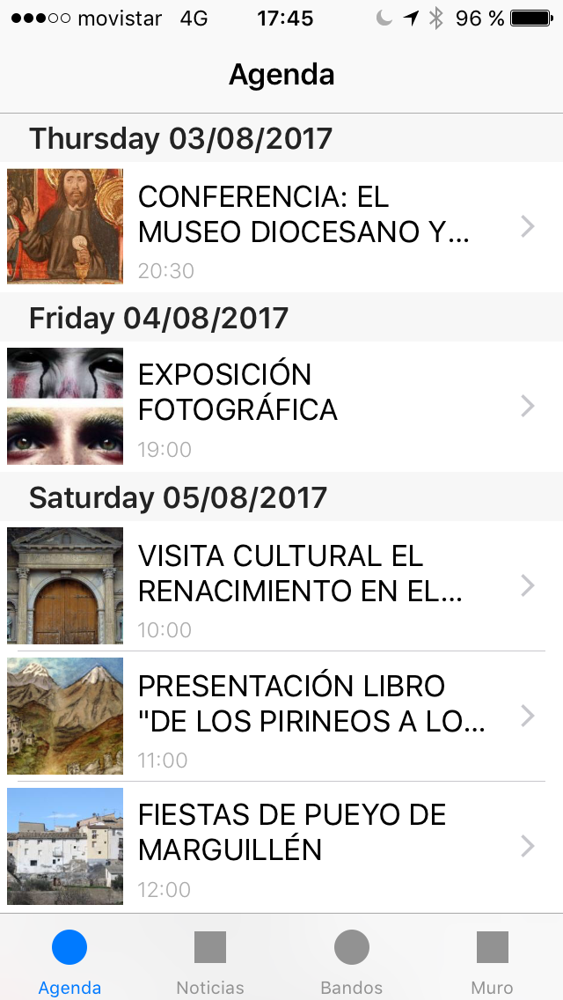
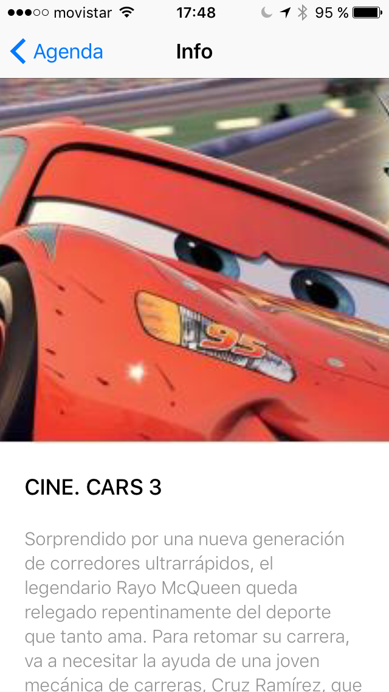
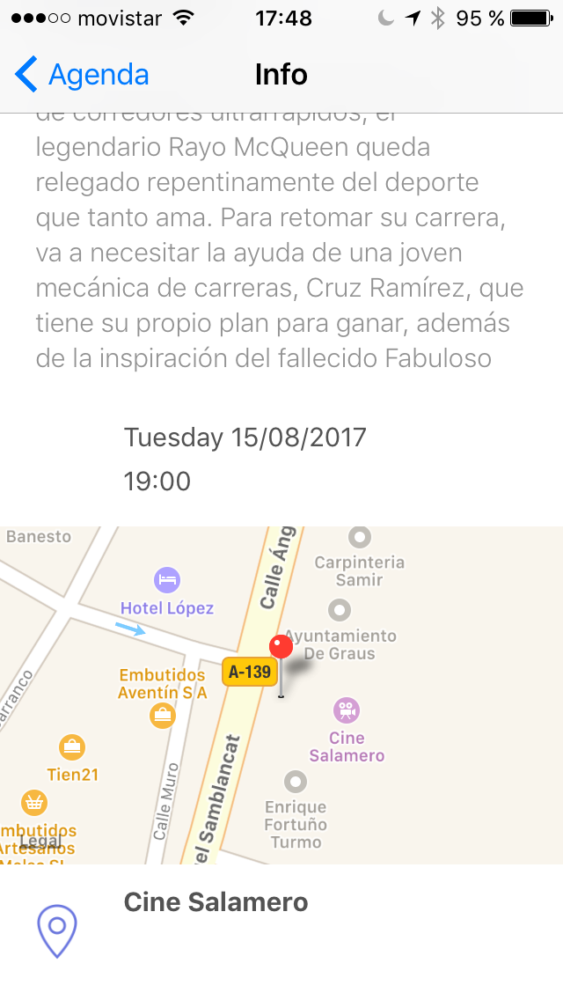

# Graus iOS

This is an iOS application for the village of [Graus](https://en.wikipedia.org/wiki/Graus) in Spain (but It can be modified to be used for whatever city). It consists in a list of events (with detail page) that happens in the village, a list of news, and a social wall.

  

## Architecture
The approach for the app is a Clean architecture with RxFeedback for the presentation layer.

### Clean architecture

### RxFeedback

Work in progress
